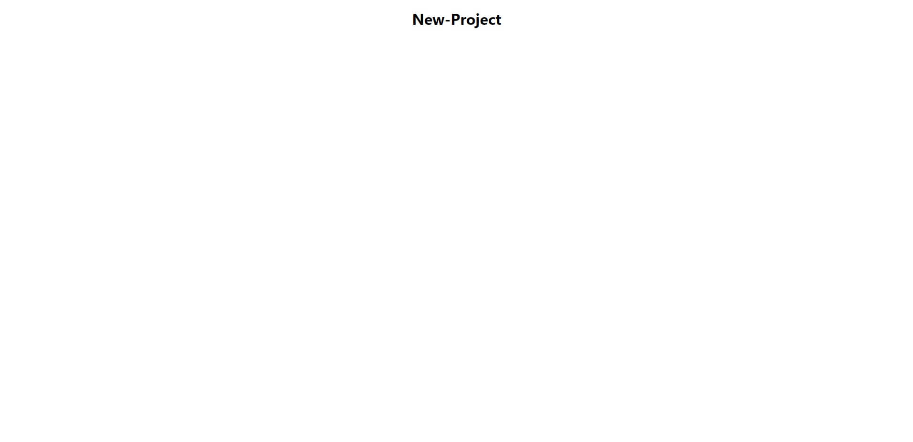

---
title: Create-React-App Setup Explained
date: "2020-01-22 11:00:00"
category: "React"
description: "How to use Create React App and an explaination of what the files created do. Explains Project structure and purpose of files."
featuredImage: "./sea-2755858_1280.jpg"
tags: ["React", "create-react-app", "Tools"]
---

Create React App is a command line tool to build and deploy single-page `React` applications. It uses `webpack` and other packages under the hood for easy development setup. It is a great tool to use when you are first learning **React** as it lets you focus on writing components.

&nbsp;

First make sure you have **Node** installed (or download it [here](https://nodejs.org/en/download/)). Choose a name for the project and enter the command

```bash
npx create-react-app project-name
```

npx is an npm package runner that uses the latest version of `create-react-app` for us.

&nbsp;

Once the project is setup, run the application by changing directories into your project folder and running the start script:

```bash
cd project-name
npm start
```

This command will start our web application up in the browser, by default at the address `http://localhost:3000/`

> If you want to host the app on a different port, change the start script to whatever port you like such as `"PORT=3005 react-scripts start"`

Create React App set up a folder structure for us with the following files:

```bash
project-name/
 - README.md
 - node_modules
 - package.json
 - package-lock.json
 - .gitignore
 - public/
   - favico.ico
   - index.html
   - manifest.json
 - src/
   - App.css
   - App.js
   - App.test.js
   - index.css
   - index.js
   - logo.svg
   - serviceWorker.js
   - setupTests.js
```

**create-react-app** comes with `start` and `build` scripts sufficient to run and deploy an application on the web. The rest of this tutorial will explain the files that were created.

## Project Breakdown

Each **React** application will include source code which is compiled into `bundled` javascript, and loaded into an `HTML` file. The source code is written in the `src` and HTML is output in the `public` folder.

### README.md

This is a generic **markdown** file which can include information about the project and is displayed on a **github** repo page if code is stored there.

### node_modules/

This folder contains all the 3rd party dependency modules which are installed in an application. This folder should not be included in the `git` repo as it is very large and other users can download the same versions from `NPM`. There is no need to change any of this code and it should be included in the `.gitignore` file.

### package.json

This file is required for a **node** application and includes information about the project along with `scripts` and additional `dependencies`. Scripts can be added into an object here and run using `npm run scriptname`. Dependencies will be automatically tracked here along with their version number.

### .gitignore

This file contains a list of files and folders in the project which should be ignored by git. This often includes dependencies or private environmental variables.

## public folder

The public folder is where the bundled javascript code is output by create-react-app. There are a bunch of files generated here including icons which you can replace. Some files which are important to note include

### index.html

This is the `html` file which runs the bundled javascript. A `div` is included here to populate the entire **React** application.

### manifest.json

This is a `json` file that is meant to easily provide web crawlers with information about your application. Information here includes names, color themes, and site icons.

## src folder

This folder is where all of you application logic will live. It also contains the entrypoint of your React code. There is a `logo.svg` file here pregenerated which can be replaced or deleted.

### index.js

This is the `JavaScript` file which will run when your application is started. It imports your application code from the `App.js` component and renders it in the `root` div located in `index.html` in the `public` folder.

### App.js

This is the main component for your **React** code. Each component you make in your project will be a descendant of this component. You can build an entire working application in this file.

### App.css

This is your stylesheet for `css` rules. **create-react-app** comes preconfigured to use `css` stylesheets. Also, `scss` files can be used by simply installing the `node-sass` module.

### index.css

This is a secondary `css` file with generic font data that can be deleted or utilized for global css code.

### serverWorker.js

Service works can gather data about the users settings or browser configuration to act accordingly. This is a **progressive web app** feature which can be extremely helpful in production applications. This is another file which is safe to delete for development purposes.

### Testing - setupTest.js and App.test.js

This build comes preconfigured with `jest` and `react-testing-library` as well. The `setupTest.js` file is where you can include your test configurations and `App.test.js` is a basic test file. You can also safely delete both of these files if you are not experienced in testing. 

### Overview

Most of the files here are already configured so that we won't have to change them again. `App.js` is the main file and component for our development. Separate component files can and should be created for larger applications.

&nbsp;

Let's remove some of the excess code so we can start from scratch. Take out the logo import, and everything in the App div. Then, add a header with our project name.

&nbsp;

In App.js:

```javascript
import React from "react"
import "./App.css"

const App = () => {
  return (
    <div className="App">
      <h1>New-Project</h1>
    </div>
  )
}

export default App
```



## Conclusion

Create React App is a very useful tool to quickly build a **React** project with little configuration necessary. The **React** [docs](https://reactjs.org/docs/create-a-new-react-app.html) themselves suggest to use it "If you’re learning React or creating a new single-page app". There are other build tools such as `Next.js` and `Gatsby`, though it is generally easy to copy over all of your code if you decide to use a different tool.