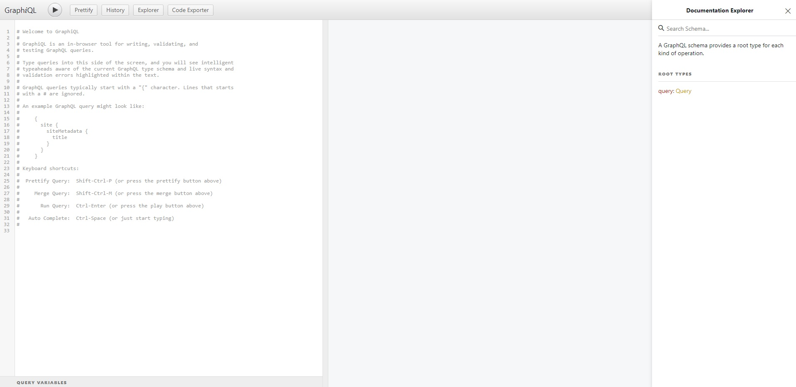

## What is Gatsby?
Gatsby is a React framework for generating serverside rendered applications. Gatsby is opinionated, in that it uses GraphQL by default to access interal dependencies such as images or blog posts. It is an excellent tool for setting up static pages, as well as for learning GraphQL which is currently seeing [rapid adoption](https://2019.stateofjs.com/data-layer/graphql/).
&nbsp;
## What is GraphQL?
GraphQL is a query language for APIs that allows the developer to specify exactly which data they need from the server. It works by connecting a single endpoint to a graph representation of the data. GraphQL is typed, self-documenting, and often preferable to REST when using lots of API endpoints.

## Gatsby Setup
In this tutorial we will be using the [Gatsby blog starter](https://github.com/gatsbyjs/gatsby-starter-blog) which is the most popular Gatsby starter, written by [Kyle Matthews](https://twitter.com/kylemathews). This starter has lots of GraphQL queries already written for us to reference and learn from. Setup up a new Gatsby project now by first installing the command line tool
```bash
npm install -g gatsby-cli
```
This will allow you to start a new gatsby project with the command `gatsby new project-title` with an optional fourth argument of the link to the starter repo you want to use. Start a new Gatsby blog now by entering the command
```bash
gatsby new gatsby-starter-blog https://github.com/gatsbyjs/gatsby-starter-blog
```
> In this tutorial we will mostly be focused on the GraphQL queries rather than the React or blog code itself. If you want to learn more about Gatsby in general, check out [this tutorial](https://www.code-boost.com/gatsby-basics/) for the basics.

You can start the project by changing into the project folder and using the command
```bash
gatsby develop
```

## Writing Queries (GraphQL Playground)
Running a Gatsby app will setup a development server as usual, in addition to a **GraphiQL** playground to navigate your project's dependency graph. Open this in the browser now at
```bash
http://localhost:8000/___graphql
```

In this tool we can write queries on the left and run them on the right. At the far right of the screen there is documentation for our GraphQL queries. Click on the **Query** link under *ROOT TYPES* to view all of the queries we have available along with their inputs. Since GraphQL is a **typed** language, we can view the possible and required inputs for each of these.
&nbsp;
We can write our first query now by opening a pair of brackets on the left 
```bash
{

}
```
Place your cursor in between these brackets and you will notice if you press **Ctrl + Space** or **Shift + Space** you will have a dropdown autocomplete with the available queries. This feature greatly increases the speed of development and capacity to traverse large APIs efficiently.
&nbsp;
Select `site` now and you will notice there is a red underline under it. This is because the field does not have a specific value associated with it to return. In this case, site is equivalent to a folder that we're required to specify at least 1 file in. 
&nbsp;
Open a new set of brackets and you will notice there is another list of available fields to query. Valid GraphQL queries require you to return specific values. Here we can select `port`, and underneath it `buildTime` so the query looks like
```graphql
{
  site {
    port
    buildTime
  }
}
```
Run the query by clicking on the play button and you should see 
```json
{
  "data": {
    "site": {
      "port": 8000,
      "buildTime": "2020-05-06T15:03:46.000Z"
    }
  }
}
```
Once we have specified the data we're looking for in GraphQL to Gatsby, it will return a JSON representation of that exact data. This is great because it allows developers to focus more on the shape of their API, rather than how they will write queries.

## Query Data in Gatsby
There are a few different syntaxes to be aware of for setting up queries in Gatsby
## pageQuery
This query works on pages, and can accept variables unlike static queries. Open up the `index.js` file inside the **pages** folder to see an example of this. At the bottom of the page, below the React component you will see something like this

```jsx
export const pageQuery = graphql`
  query {
    site {
      siteMetadata {
        title
      }
    }
    allMarkdownRemark(sort: { fields: [frontmatter___date], order: DESC }) {
      edges {
        node {
          excerpt
          fields {
            slug
          }
          frontmatter {
            date(formatString: "MMMM DD, YYYY")
            title
            description
          }
        }
      }
    }
  }
`
```

This query uses Gatsby's implementation of GraphQL to run the provided query, and return the specified information into a props variable `data` which can be used in the component. 
&nbsp;
You'll also notice a particular field `allMarkdownRemark` which loads in the blog post content. 


## useStaticQuery